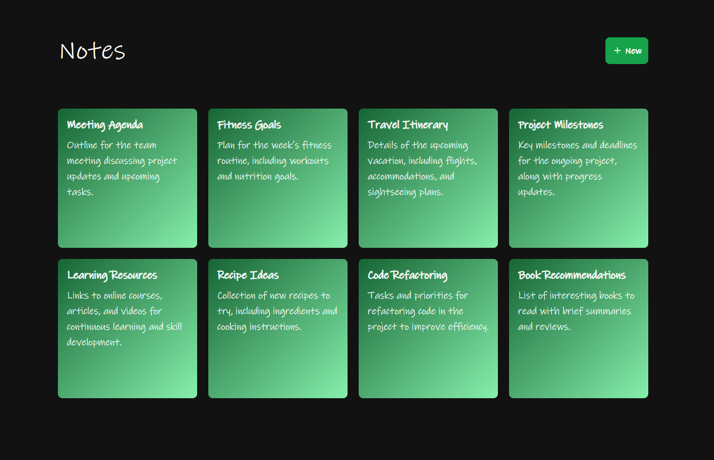

## Notes App

## Preview

 

This is a [Next.js](https://nextjs.org/) project bootstrapped with [`create-next-app`](https://github.com/vercel/next.js/tree/canary/packages/create-next-app) showcasing CRUD operations with Nextjs API, Postgres database and Prisma ORM.

## Getting Started

- Clone the project

```
git clone https://github.com/kevinooi/note_nextjs.git
```

- Go to the project directory:

```
cd note_nextjs
```

- Install dependencies

```
npm install
```

- Run the development server

```
npm run dev
```

## Setup Postgres

Visit and login at [Railway](https://railway.app/) to set up a postgres database.
Create a new project and copy the `DATABASE_URL` at the `Variables` tab.

 

Paste the `DATABASE_URL` to the `.env` file. Example can be found on `.env.example`.
```
DATABASE_URL="DATABASE_URL_VALUE"
```

## Setup Prisma

Run:

`npx prisma generate` to generate Prisma Client.

`npx prisma migrate dev` to create migrations from your Prisma schema and apply them to the database.

`npx prisma studio` to browse your data.
