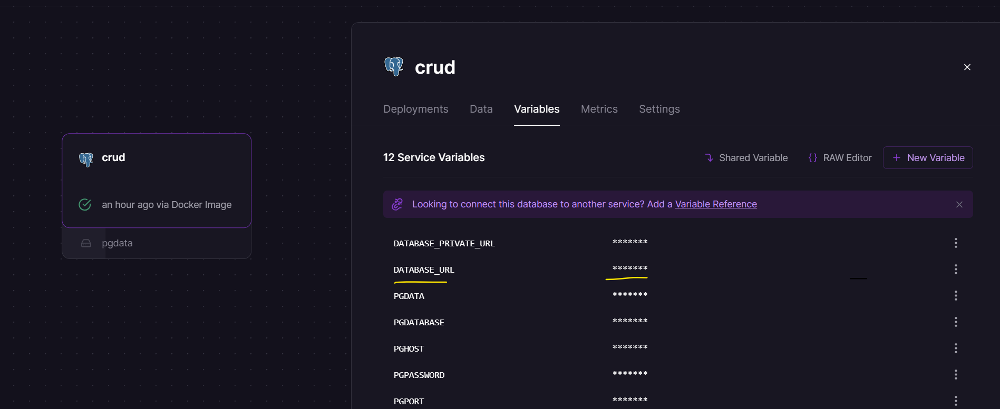

This is a [Next.js](https://nextjs.org/) project bootstrapped with [`create-next-app`](https://github.com/vercel/next.js/tree/canary/packages/create-next-app).

## Getting Started

First, run the development server:

```bash
npm run dev
# or
yarn dev
# or
pnpm dev
# or
bun dev
```

Open [http://localhost:3000](http://localhost:3000) with your browser to see the result.

### Setup Postgres

Visit and login at [Railway](https://railway.app/) to set up a postgres database.
Create a new project and copy the `DATABASE_URL` at the `Variables` tab.

 

Paste the `DATABASE_URL` to the `.env` file. Example can be found on `.env.example`
```
DATABASE_URL="DATABASE_URL_VALUE"
```

### Setup Prisma

Run:

`npx prisma generate` to generate Prisma Client.

`npx prisma migrate dev` to create migrations from your Prisma schema and apply them to the database.

`npx prisma studio` to browse your data.
